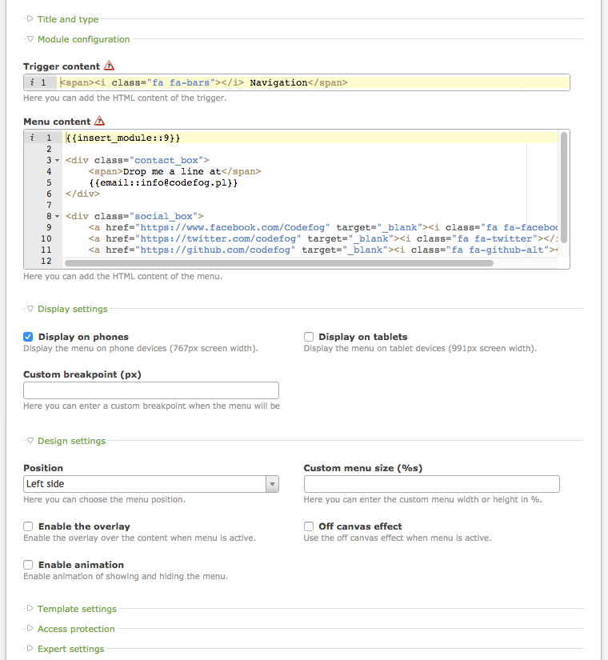

# Mobile Menu – Documentation

## Panel content

Firstly, you need to plan what should be inside the mobile panel. Usually it is a good place for navigation 
and some additional content like contact details or even search box. Create then the necessary modules and write down 
their IDs - they are mandatory for the insert tag.

## Create a module

Once the content for panel is ready, please create a new front end module of `Mobile menu` type. The first thing 
you need to configure is the visibility of the module on the mobile devices. Set whether the menu should be visible
on the phones, tablets or both. You can also enter your own breakpoint in pixels. Please note that setting a custom 
breakpoint value will override the two other checkbox settings.

The trigger content is the HTML code of the element which when clicked will open the panel. In the below example 
I used a simple label wrapped in `<span>` tag.

The menu content is the actual content of the panel. Here you should insert the navigation module using 
the `{{insert_module::ID}}` insert tag. Additionally, you can for example add contact information or any other 
elements you'd like to have.



## Design settings

Next, you should decide where the menu should be displayed. You can either choose left or right side, top or the bottom.
Here you can also specify the width or height (depends on position type) dimension in percent (%). If you leave 
this field empty, the default value will be used which is 80%.

Additionally, you can enable the overlay effect which will overlay the website content with a dark transparent layer 
when the menu is open. The off canvas effect will cause your website content to be visually pushed to the side, 
making space for mobile menu content.

To make it even more attractive, it is possible to set the animation during opening and closing the menu. After enabling
the animation, please enter the animation duration in milliseconds (1000ms = 1s). The default value is 500ms.

> The mobile menu comes with a very minimal styling. It's not a bug, it's a feature - it is totally up to the user 
> what styles should be applied to it.

## Custom close buttons

Since version 2.1 it is possible to have the custom close buttons within the menu content. Every element that performs 
close action should receive the following data attribute:

```html
<a href="#" data-mobile-menu="close">Close</a>
```

## Include the module in the layout

Do not forget to include the module in the page layout! Depending on your configuration and style of developing 
the websites, you can either do that by adjust the page layout settings or using the `{{insert_module::ID}}` insert tag 
in some HTML front end module that is used to render page header.
